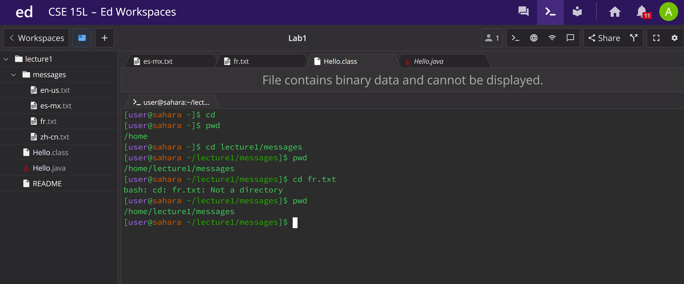
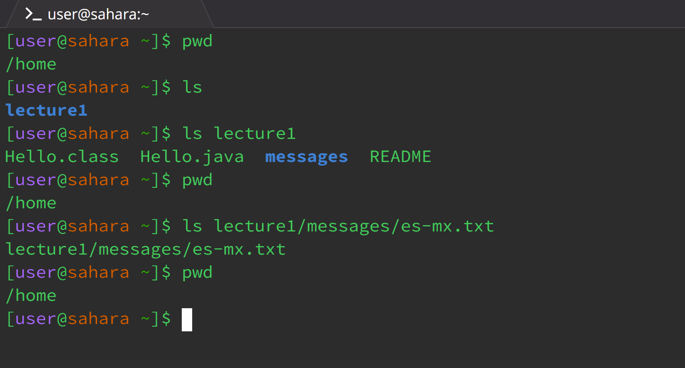
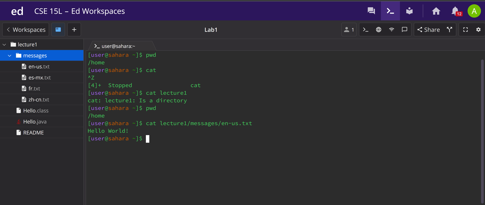

### Lab report 1:

## cd:

The first time the cd command was run, it set the directory as `/home`, which is shown when I used the command `pwd`. Since there are no arguments it sets the directory to `/home` which is the default directory. In this case the directory didn't change because we were already in `/home`, but if we were in another directory and entered `cd`, it would've set the directory as `/home`.

The second time I ran the cd command with an argument of the messages directory, it set the directory to home/lecture1/messages.

The third time I ran the cd command with an argument of the fr.txt file located in the messages directory, it gave us an error, as a file cannot be a directory. The directory did not change after running the command the third time, because previous argument was a filename, and as a result the directory is still home/lecture1/messages.

ls:

The first time the ls command was run, it showed us the contents of the default directory that we were in which is home. The reason it shows us the contents of home was becasue we entered no arguments and as a result it showed us the directory that were initially in. 

The second time the command was run, I entered a path to folder lecture1 and it showed us the contents in that folder. The reason for this is becasue I entered lecture1 as the argument and as a result it gave us the contents of lecture1. It did not change the directory though which is shown when I ran pwd again.

The third time the command was run resulted in the terminal giving us the path to the file. The argument I gave was the path to the file es-mx.txt, and it gave us the path to just that file. The directory did not change when we ran that command.

cat:

The first time the cat command was run, nothing happened. I think it was expecting some input, so I pressed ctrl+z to exit the input part. I then checked the directory to see if anything had changed but we were in the home directory.

The second time I ran it, I entered a path to the folder lecture1 and it told me that what I had entered was a directory. The directory still hadn't changed. 

The third time I ran it, it entered the path to a file as the argument, and it printed the contents of the file I entered. The directory did not change and remained home.
