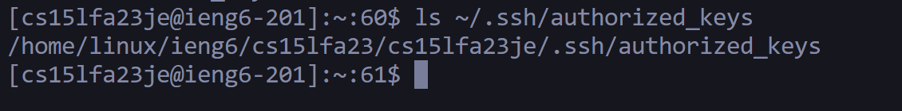

## Lab Report 2

## Part 1

### Code

```
import java.io.IOException;
import java.net.URI;
import java.util.ArrayList;
class Handler implements URLHandler {
    String line = "";
    int num = 0;

    public String handleRequest(URI url) {
        if (url.getPath().equals("/add-message")) 
        {
            String[] parameters = url.getQuery().split("=");   
            if(parameters[0].equals("s"))
            {
                num++;
                line += num + ". " + parameters[1] + "\n";
                return line;
            }          
        }
        return "404 Not Found!";
    }
}

class StringServer {
    public static void main(String[] args) throws IOException {
        if(args.length == 0){
            System.out.println(
                "Missing port number! Try any number between 1024 to 49151");
            return;
        }

        int port = Integer.parseInt(args[0]);

        Server.start(port, new Handler());
    }
}
```

### Server


- The method called in the screenshots is ```handleRequest```.
- The argument of ```handleRequest ``` is ```url``` which is a member of the ```URI``` class, and initially, the value is  ```localhost:2500/```, then it becomes ```localhost:2500/add-message?s=Hello```, and finally it becomes ```localhost:2500/add-message?s=How%20are%20you```.
- The relevant fields of the class are:
  - path: This is called by ```getPath()```, and remains unchanged in the screenshots because even though the url is changed, it extracts the same Path as the previous part. Its value is `/add-message`.
  - query: This is called by  ```getQuery()```, and this value is changed in the screenshots. Initally it's value is ```s=Hello```, and it changes to ```s=How%20are%20you```.
 

## Part 2

### Path to the private key.


### Path to the public key.



### Logging into ieng6 account without password.


## Part 3
I learned a lot in the 2nd and 3rd lab. Some things include how to access remote servers from the terminal of our laptops. I believe that this would be incredibly helpful in internships where we may have to connect to remote server. I even learnt how to host a server on the internet and how online requests are processed. I even learnt multiple terminal commands like `mkdir` and `scp`.

