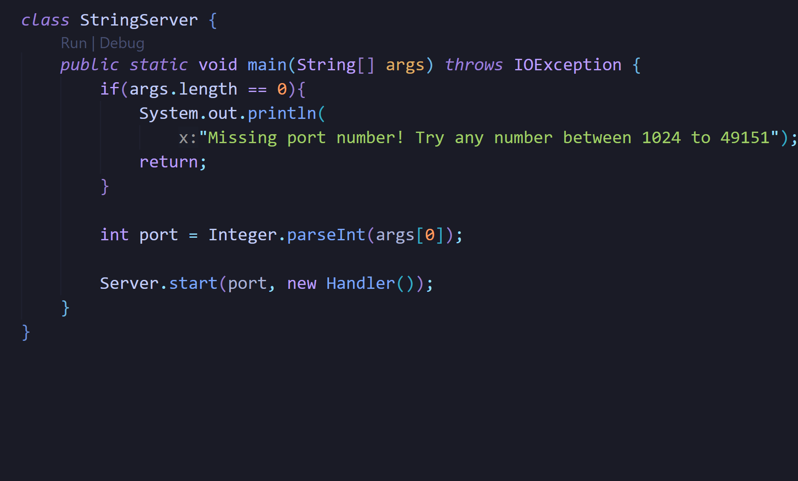

## Lab Report 2





- The methods called in the screenshots is ```handleRequest```.
- The argument of ```handleRequest ``` is ```url``` which is a member of the ```URI``` class, and initially, the value is  ```localhost:2500/```, then it becomes ```localhost:2500/add-message?s=Hello```, and finally it becomes ```localhost:2500/add-message?s=How%20are%20you```.
- The relevant fields of the class are:
  - path: This is called by the ```getPath()```, and remains unchanged in the screenshots because even though the url is changed, it extracts the same Path as the previous part. Its value is `/add-message`.
  - query: This is called by the ```getQuery()```, and this value is changed in the screenshots. Initally it's value is ```s=Hello```, and it changes to ```s=How%20are%20you```.
