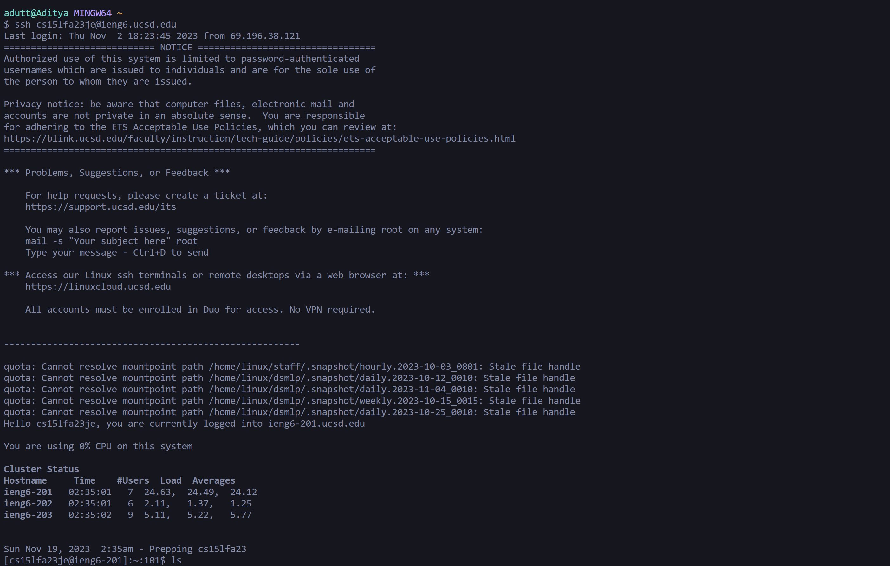

# Lab Report 4 - Vim

## Log into ieng6 

Command : `ssh cs15lfa23je@ieng6.ucsd.edu`

I found the command in Lab 2 and edited the ID so that I could log into my ieng6 account.


## Cloning the fork of the repository

Command : `git clone git@github.com:adutt1010/lab7.git`


## Running the test

Command :
``` 
ls
cd lab7
ls
bash test.sh
```
This was used to enter the directory of the file I cloned and running the tests.


## Editing the code to fix the file

Command :
`vim ListExamples.java `

Keys Pressed :
`<k> <k> <k> <k> <k> ...... <k>` This key is used to go down in Vim editor, and I kept pressing it until I reached the line that needs to be changed.

`<l> <l> <l> <l> ...... <l>` This key is used to navigate right in Vim editor, and I kept pressing it until I reached the portion of the line that needs to be changed.

`<x>` This key is used to delete characters in Vim editor, and I used it to remove `1` from `index1` making it `index`.

`<i>` This key is used to enter insert mode in Vim editor, and I used it to add `2` to `index` from the previous line. This makes it `index2`.

`<ESC>` This key is used to enter normal mode in Vim Editor, and I used it to exit insert mode and return to the normal mode.

`:wq` This command is used to save the changes you made to the file and exit Vim, and I used it to save the changes I made to `ListExamples.java`.


## Running the tests

Command :
```
bash test.sh
```
This was used to run the tests again to see if they were succesful after the changes.

## Pushing the changes

Command :
```
git add . #This is used to stage changes for the next commit for all files in the directory 
git commit -m "Changes made" #This is used to save the changes for all files in your local respository
git push #This is used to save the changes to the github repository
```
This was used to ensure that the changes were made on the forkerd repository on my github. I have attached a screenshot showing that the changes were succesfully made in github.
[image](images/labrep413.png)
