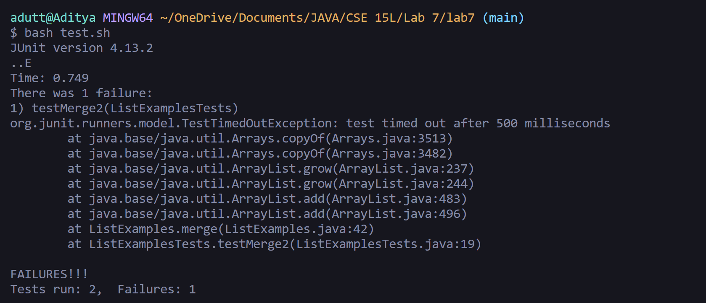

# Lab Report - 5

## The Post

### Title : Question regarding bug in Lab 7

### Description :
In the lab7 folder, I tried running test.sh in order to run the tests. When I ran the tests, I ended up getting an error message stating that one of the tests had failed. The test that failed
was `testMerge2()`. I have attached the screenshot of the symptom.

