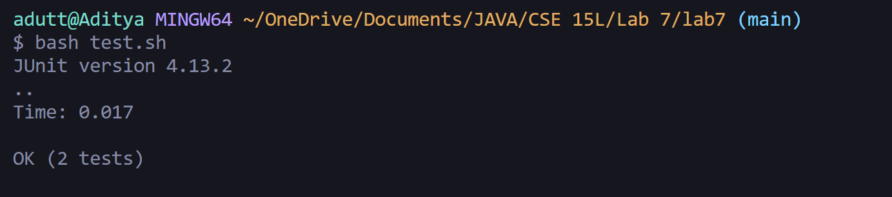

# Lab Report - 5

## 1. The Post

### Title : Question regarding bug in Lab 7

### Description :
In the lab7 folder, I tried running test.sh in order to run the tests. When I ran the tests, I ended up getting an error message stating that one of the tests had failed. The test that failed
was `testMerge2()`. I have attached the screenshot of the symptom.

I believe that the error is caused from the method `merge(List<String> list1, List<String> list2)`. I believe that there may be an infinite while loop but I don't know where and why it occurs.
Any help would be appreciated.

## 2. TA response
 
Good job, you have succesfully narrowed down the error to one of the while loops. I would suggest going to `ListExamples.java`, and analyzing the last `while` loop, you may find some errors there.

Hint: The third `while` performs operations using the second list. Compare this to the second while loop, which performs operations using the first list, and try to find the error based on 
how the second while loop is designed. Try using the second while loop as a road map.
`

## 3. The information received from TA

I went into `ListExamples.java`, and tried analyzing the various `while` loops. I saw the similarity between the second and third `while` loop, and tried changing `index1` in the second `while` loop to `index2`. The error was caused because the iterator being used for the second list was `index2`, however instead of incrementing `index2`, `index1` was being incremented. Here is the screenshot of the succesful test run.

## 4. Information required for understanding the setup

Here is the repository structure 
lab7
|-- ListExamples.java
|-- ListExamplesTest.java
|-- test.sh
|-- lib
|   |-- hamcrest-core-1.3.jar
|   |-- junit-4.13.2.jar

